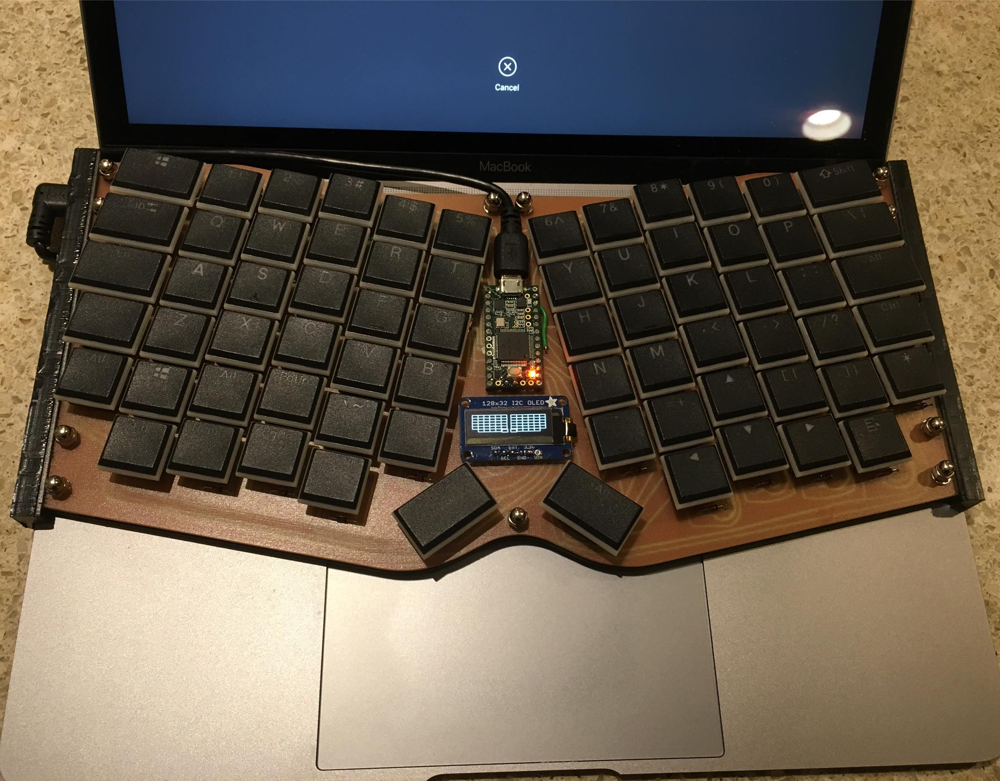

# FreiKey: Firmware for my custom keyboards
I've now made 3 fully custom keyboards. [ErgoBlue](https://github.com/kevinfrei/ErgoBlue) was just a gateway drug!

The first two are the same keyboard (one for work, one for home!). The third,
however, is a keyboard I plan on taking with me when I travel. In order, they're
named "FreiKeys" and "Betterfly". FreiKeys is this beauty:

I designed it with AutoDesk Fusion360, and milled it (PCB, aluminum plate, and
walnut case) with my sweet, sweet [MillRight Power Route
CNC](https://millrightcnc.com/product/millright-cnc-power-route-kit-bundle/). I
can't say enough good things about MillRight. The sales process was marvelous,
providing me lots of support while I was assembling & testing out the machine
and the forums are a great resource. Since I enjoyed both the process and the
end result so much, I decided to look around and see if there was another place
I would like a nice custom keyboard. As luck would have it, my work laptop is a
[2017 MacBook 12"](https://support.apple.com/kb/sp757), which is a great laptop
for wandering around, walking between buildings at work, and unfolding fully
even when boxed into cramped airline seats. That
["butterfly"](https://bgr.com/2018/07/14/macbook-pro-2018-butterfly-keyboard-fixed-ifixit/)
keyboard, though? A steaming POS. Almost as noisy as MX Blue's, but (I'm *not*
exaggerating) only slightly more tactile than the original [Surface Touch
keyboard](https://support.microsoft.com/en-us/help/4039633/surface-touch-cover).

So, given how much I've come to enjoy my little thumb cluster, I stuck that
design on a single PCB. My only real complaint about the FreiKeys is that I have
only a single LED to display any sort of status. So, while designing the
Betterfly board, I decided to toss on a little OLED. I really did like having
that around on my old (now unused) Infinity ErgoDox. I picked up a [Teensy
3.2](https://www.pjrc.com/store/teensy32.html), and an [SSD1306 128x32 I2C OLED
from AdaFruit](https://www.adafruit.com/product/931), and away we go:

That was a photo before I had any of the software working: I just wrote a little
display routine to validate that all of the key switches worked properly. Since
that photo, I have it working as a normal keyboard, albeit only as a single
layer. I've been cleaning up & restructuring the firmware quite a bit, in order
to support Teensy (and I hope to support a wireless OLED for FreiKey as some
point in the future). I'm still trying to figure out a pleasing way to both
abstract out all the differences between the Teensyduino keyboard stuff and the
AdaFruit Bluetooth keyboard stuff, and add more flexibility to my firmware. (I
know, I guess I could try to port to QMK or something, but I'm an engineering
manager and have been for more than half my career, now, so I'm actively looking
for ways to scratch the coding itch that keeps me well clear of doing any damage
to the code that my far-more-talented-software-developers-than-myself who I
support write :) So, in the mean time, I'm also putting together a better write
up of both [FreiKey](FreiKeys.md) and [Betterfly](Betterfly.md).

## Work in progress:

1. I'm going to integrate the OLED display to do something semi-useful. At least
showing the current keyboard mode seems like something worth doing.

2. I want a better, more flexible way to design a keyboard layout. QMK has these
bad C preprocessor macros, and that's roughly how this stuff works. I'd prefer
more expressiveness, even though that means it might not look quite as nice. The
"Keyboard Layout Language" from InputClub doesn't seem too terrible, though I'd
rather not need a full separate compilation step (DSL's are useful, except that
it's yet another set of things to build/maintain/debug/learn). Maybe I'll try to
do something insane with the template processor. [Eric](http://ericniebler.com)
might even be willing to help me, if I ask *real* nicely...
